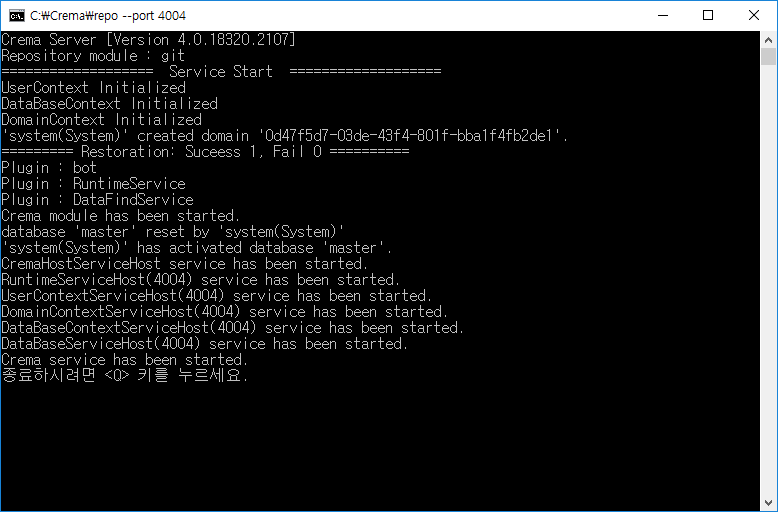
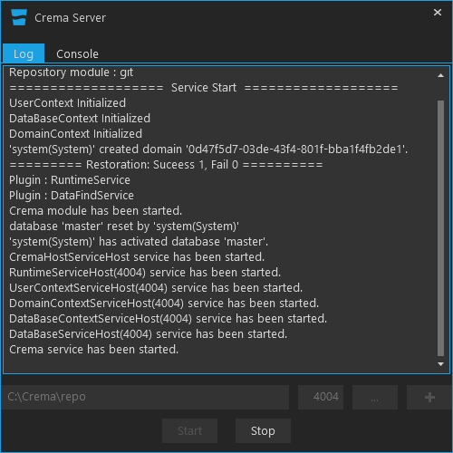
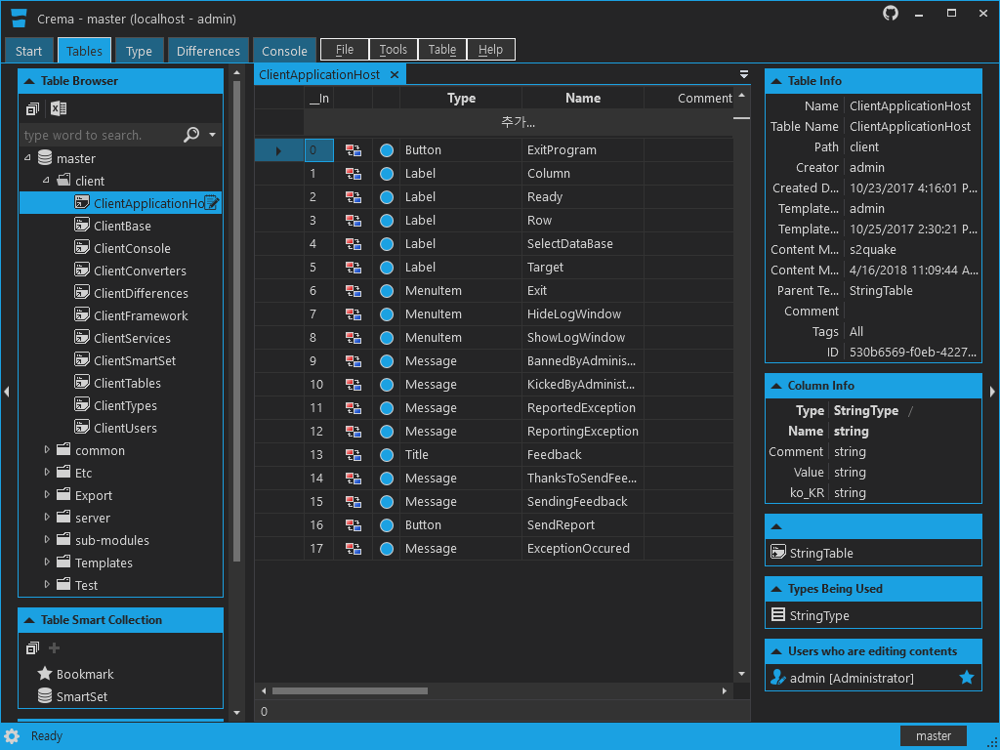
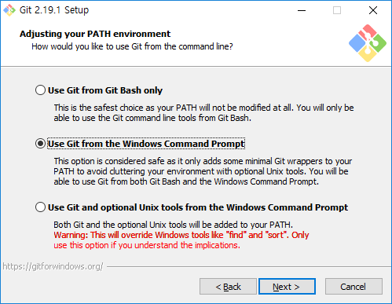

# Crema
크레마는 게임 개발에 필요한 데이터를 만들고 편리하게 사용하기 위한 솔루션입니다. 
게임 디자이너에게는 데이터를 생성 및 관리를 할 수 있게 UI를 제공하며
게임 프로그래머에게는 데이터를 쉽게 사용할 수 있도록 코드와 바이너리 데이터 생성기능을 제공합니다.

    1. Design Data
    2. Generate Code and BinaryData
    3. Include Code And BinaryData in your project.
    4. Add codes to read and use (c#, typescript, c++)
    5. Compile and Run

# Build
## Windows
1. https://visualstudio.microsoft.com/downloads 에서 Visual Studio Community 이상의 버전 설치
2. 명령 프롬프트에서 `git clone https://github.com/s2quake/Crema.git --recursive` 을(를) 실행
3. 명령 프롬프트에서 `cd Crema` 을(를) 실행하여 클론된 Crema 경로로 이동
4. 명령 프롬프트에서 `.\build.bat` 을(를) 실행하여 빌드
5. build 경로에서 결과물을 확인
    * crema
    * cremaconsole
    * cremadev
    * cremadevApp
    * cremaserver
    * cremaserverApp

## Mac OS
1. https://visualstudio.microsoft.com/downloads 에서 Visual Studio Community 이상의 버전 설치
2. 터미널에서 `git clone https://github.com/s2quake/Crema.git --recursive` 을(를) 실행
3. 터미널에서 `cd Crema` 을(를) 실행하여 클론된 Crema 경로로 이동
4. 터미널에서 `./build.sh` 을(를) 실행하여 빌드
5. build 경로에서 결과물을 확인 (Mac OS 에서는 콘솔형태의 프로그램만 사용 가능)
    * cremaconsole
    * cremadev
    * cremaserver

## 주요 특징
### 게임 디자이너
* 동시 편집
* 엑셀 파일 내보내기(export) 및 가져오기(import)
* 데이터 버전 관리 및 복구
* 데이터 비교 및 병합

### 게임 프로그래머
* 코드 및 바이너리 데이터 생성
   * c#, typescript, c++
* 쉽고 빠른 데이터 로딩
* 키 값을 사용한 쉽고 빠른 데이터를 열람

### 기타
* javascript 언어를 사용한 자동화 작업
* 다양한 형태의 내보내기 지원(미포함)
   * excel, xml, json, yaml, mssql, mysql, sqlite
* Window Service 지원
* mac osx에서 사용가능
   * 터미널 기반 프로그램 한정

## 프로그램 구성
### cremaserver
콘솔 기반 크레마 서버 구동 프로그램

    실행 예시
    cremaserver.exe run repo-path
### cremaserverApp
GUI 기반 크레마 서버 구동 프로그램

    실행 예시
    cremaserverApp.exe --base-path repo-path --run
### crema
UI 기반 크레마 클라이언트 프로그램

### cremaconsole
콘솔 기반 크레마 클라이언트 프로그램

    실행 예시
    cremaconsole.exe connect localhost
    cremaconsole.exe run javascript.js
### cremadev
콘솔 기반 크레마 코드 및 바이너리 데이터 생성 프로그램

    실행 예시
    cremadev.exe get localhost outputPath --lang cs
    cremadev.exe get localhost outputPath --lang ts
    cremadev.exe get localhost outputPath --lang cpp

## Development Environment
* Microsoft Visual Studio Community 2017
* C# 7.2
* .NET Framework 4.5
* WPF(Windows Presentation Foundation)
* WCF(Windows Communication Foundation)

## 실행 필수 요소
* [git](https://git-scm.com/)
    * 미설치시 cremaserver 구동 불가능

## 사용된 프로젝트
* Second Earth
* 프로야구 630
* 소환사가 되고 싶어
* H2
* 팡야 모바일

## Libraries
* [Caliburn.Micro](https://caliburnmicro.com/)
* [ClosedXML](https://github.com/ClosedXML/ClosedXML)
* [DocumentFormat.OpenXml](https://github.com/OfficeDev/Open-XML-SDK)
* [jint](https://github.com/sebastienros/jint)
* [log4net](http://logging.apache.org/log4net/)
* [ModernUI.WPF](https://github.com/firstfloorsoftware/mui)
* [MahApps.Metro](https://github.com/MahApps/MahApps.Metro)
* [Newtonsoft.Json](https://www.newtonsoft.com/json)
* [Newtonsoft.Json.Schema](https://www.newtonsoft.com/jsonschema)
* [WindowsAPICodePack-Shell](https://github.com/aybe/Windows-API-Code-Pack-1.1)
* [YamlDotNet](https://github.com/aaubry/YamlDotNet/wiki)
* [Extended WPF Toolkit](https://github.com/xceedsoftware/wpftoolkit)
* [diffplex](https://github.com/mmanela/diffplex)

## License
MIT License

Copyright (c) 2018 Ntreev Soft co., Ltd.

Permission is hereby granted, free of charge, to any person obtaining a copy of this software and associated documentation files (the "Software"), to deal in the Software without restriction, including without limitation the rights to use, copy, modify, merge, publish, distribute, sublicense, and/or sell copies of the Software, and to permit persons to whom the Software is furnished to do so, subject to the following conditions:

The above copyright notice and this permission notice shall be included in all copies or substantial portions of the Software.

THE SOFTWARE IS PROVIDED "AS IS", WITHOUT WARRANTY OF ANY KIND, EXPRESS OR IMPLIED, INCLUDING BUT NOT LIMITED TO THE WARRANTIES OF MERCHANTABILITY, FITNESS FOR A PARTICULAR PURPOSE AND NONINFRINGEMENT. IN NO EVENT SHALL THE AUTHORS OR COPYRIGHT HOLDERS BE LIABLE FOR ANY CLAIM, DAMAGES OR OTHER LIABILITY, WHETHER IN AN ACTION OF CONTRACT, TORT OR OTHERWISE, ARISING FROM, OUT OF OR IN CONNECTION WITH THE SOFTWARE OR THE USE OR OTHER DEALINGS IN THE SOFTWARE.

